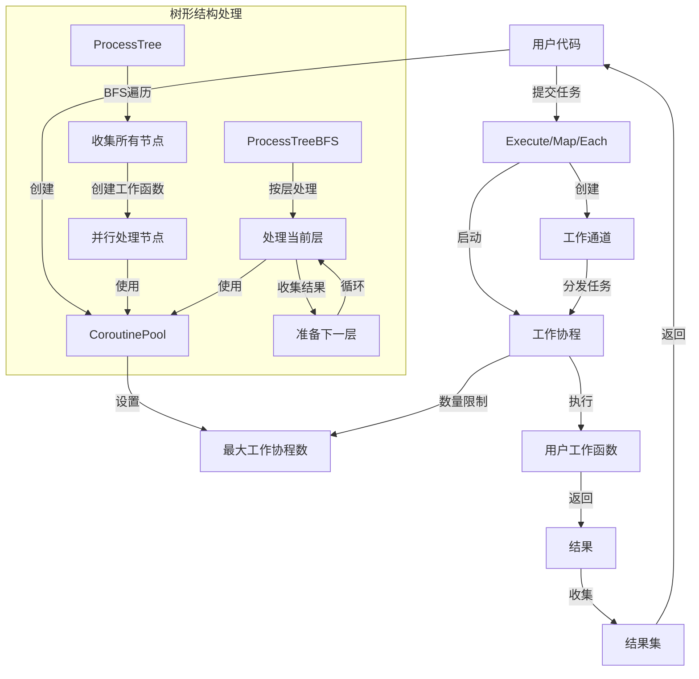

# 协程池 (Coroutine Pool)

协程池是一个用于控制并发执行的Go语言工具包，它提供了简单易用的API来管理goroutine的并发数量，并支持结果收集、上下文取消和树形结构处理。

## 主要功能

- 控制并发数量：限制同时运行的goroutine数量，避免资源耗尽
- 泛型支持：使用Go 1.18+的泛型特性，支持任意类型的数据处理
- 结果收集：自动收集所有goroutine的执行结果和错误
- 上下文支持：支持通过context取消正在执行的任务
- 树形结构支持：提供并行处理树形结构的功能

## 原理图



## 基本用法

```go
package main

import (
    "context"
    "fmt"
    "time"
    
    "github.com/your-username/tong/helper/coroutine"
)

func main() {
    // 创建一个最大并发数为5的协程池
    pool := coroutine.NewCoroutinePool[int](5)
    
    // 创建10个工作函数
    works := make([]coroutine.WorkFunc[int], 10)
    for i := 0; i < 10; i++ {
        idx := i // 捕获循环变量
        works[i] = func() (int, error) {
            // 模拟耗时操作
            time.Sleep(100 * time.Millisecond)
            return idx * 2, nil
        }
    }
    
    // 执行并获取结果
    ctx := context.Background()
    results := pool.Execute(ctx, works)
    
    // 处理结果
    for _, result := range results {
        if result.Err != nil {
            fmt.Printf("Error at index %d: %v\n", result.Index, result.Err)
        } else {
            fmt.Printf("Result at index %d: %d\n", result.Index, result.Value)
        }
    }
}
```

## 并行处理切片

```go
func processItems() {
    items := []string{"item1", "item2", "item3", "item4", "item5"}
    
    ctx := context.Background()
    results := coroutine.Map(ctx, 3, items, func(item string) (int, error) {
        // 处理每个项目
        return len(item), nil
    })
    
    for _, result := range results {
        fmt.Printf("Length of %s: %d\n", items[result.Index], result.Value)
    }
}
```

## 使用Each函数

```go
func processWithEach() {
    items := []int{1, 2, 3, 4, 5, 6, 7, 8, 9, 10}
    
    ctx := context.Background()
    errors := coroutine.Each(ctx, 4, items, func(item int) error {
        // 处理每个项目，不需要返回值
        fmt.Printf("Processing item: %d\n", item)
        return nil
    })
    
    // 检查错误
    for i, err := range errors {
        if err != nil {
            fmt.Printf("Error processing item %d: %v\n", i, err)
        }
    }
}
```

## 处理树形结构

```go
// 定义树节点
type FileNode struct {
    path     string
    children []coroutine.TreeNode
}

func (n *FileNode) ID() string {
    return n.path
}

func (n *FileNode) Children() []coroutine.TreeNode {
    return n.children
}

func processFileTree() {
    // 创建树结构
    root := &FileNode{path: "/root"}
    child1 := &FileNode{path: "/root/child1"}
    child2 := &FileNode{path: "/root/child2"}
    root.children = []coroutine.TreeNode{child1, child2}
    
    // 并行处理树
    ctx := context.Background()
    results := coroutine.ProcessTree(ctx, 4, root, func(node coroutine.TreeNode) (int, error) {
        fileNode := node.(*FileNode)
        // 模拟处理文件
        return len(fileNode.path), nil
    })
    
    // 处理结果
    for nodeID, result := range results {
        if result.Err != nil {
            fmt.Printf("Error processing node %s: %v\n", nodeID, result.Err)
        } else {
            fmt.Printf("Node %s has path length: %d\n", nodeID, result.Value)
        }
    }
}
```

## 按层处理树形结构

```go
func processByLayer() {
    // 创建树结构
    root := &FileNode{path: "/root"}
    child1 := &FileNode{path: "/root/child1"}
    child2 := &FileNode{path: "/root/child2"}
    root.children = []coroutine.TreeNode{child1, child2}
    
    grandchild1 := &FileNode{path: "/root/child1/gc1"}
    grandchild2 := &FileNode{path: "/root/child1/gc2"}
    child1.children = []coroutine.TreeNode{grandchild1, grandchild2}
    
    // 按层并行处理树
    ctx := context.Background()
    results := coroutine.ProcessTreeBFS(ctx, 4, root, func(node coroutine.TreeNode) (string, error) {
        fileNode := node.(*FileNode)
        // 返回处理结果
        return "Processed: " + fileNode.path, nil
    })
    
    // 处理结果
    for nodeID, result := range results {
        if result.Err != nil {
            fmt.Printf("Error processing node %s: %v\n", nodeID, result.Err)
        } else {
            fmt.Printf("%s\n", result.Value)
        }
    }
}
```