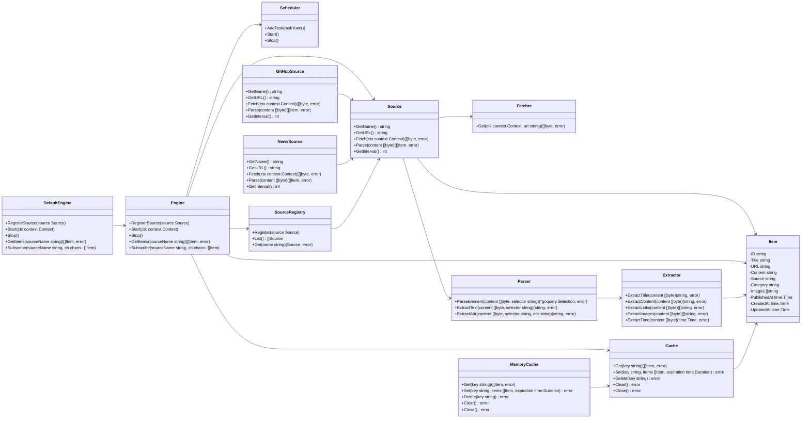
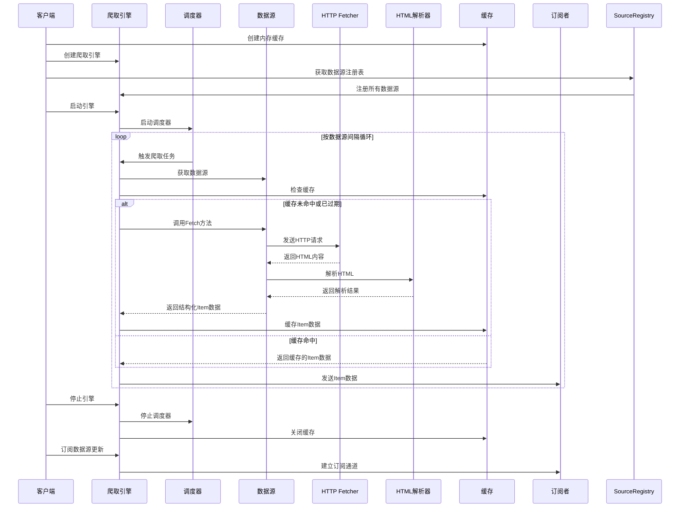
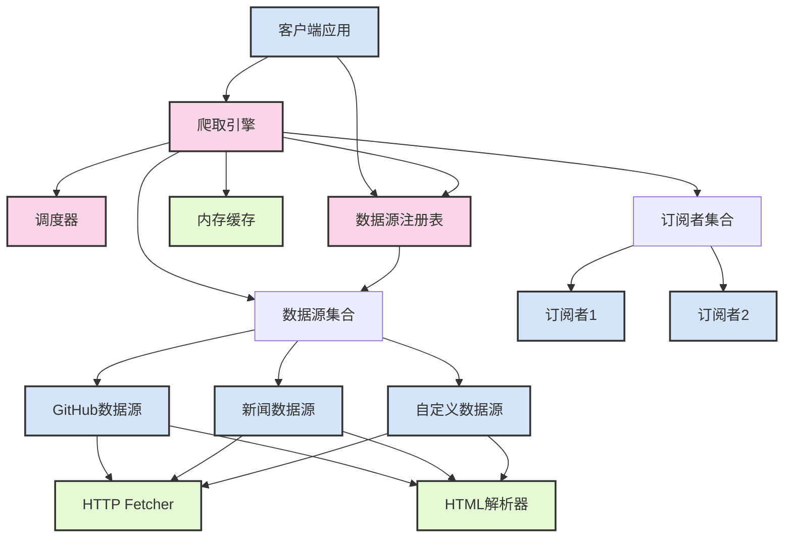

# Go 语言数据爬取包

这是一个基于 Go 语言实现的数据爬取包，遵循开闭原则和基于接口原则，具有良好的扩展性和灵活性。

## 设计原则

- **开闭原则**：对扩展开放，对修改关闭，允许轻松添加新的爬取源
- **基于接口原则**：依赖于抽象而非具体实现，提高代码的灵活性和可测试性
- **单一职责原则**：每个组件只负责一个特定功能
- **依赖倒置原则**：高层模块不依赖低层模块，两者都依赖抽象
- **模块化设计**：将功能划分为独立的子包，便于维护和扩展

## 包结构

```
crawler/
├── cmd/                  # 命令行工具
│   └── crawler/          # 命令行工具入口
├── internal/             # 内部包，不对外暴露
│   ├── cache/            # 缓存实现
│   ├── fetcher/          # HTTP 请求处理
│   └── parser/           # 通用解析工具
├── pkg/                  # 对外暴露的包
│   ├── crawler/          # 核心爬取引擎
│   ├── extractor/        # 数据提取器接口和实现
│   ├── logger/           # 日志工具
│   ├── models/           # 数据模型定义
│   └── scheduler/        # 爬取任务调度器
├── sources/              # 各种数据源的实现
│   ├── github/           # GitHub 数据源
│   ├── news/             # 新闻网站数据源
│   └── source.go         # 数据源注册机制
```

## 核心接口

### Source 接口
定义了数据源的基本行为，包括获取名称、URL、内容、解析内容和获取爬取间隔。

### Engine 接口
定义了爬取引擎的基本行为，包括注册数据源、启动/停止引擎、获取数据和订阅更新。

### Extractor 接口
定义了数据提取的基本行为，包括提取标题、内容、链接、图片和时间。

### Cache 接口
定义了缓存的基本行为，包括获取、设置、删除和清空缓存。

## UML 类图



## 时序图



## 系统架构图



## 使用示例

```go
package main

import (
	"context"
	"fmt"
	"time"

	"github.com/sjzsdu/utils/crawler/internal/cache"
	"github.com/sjzsdu/utils/crawler/pkg/crawler"
	"github.com/sjzsdu/utils/crawler/sources"
	_ "github.com/sjzsdu/utils/crawler/sources/github"
	_ "github.com/sjzsdu/utils/crawler/sources/news"
)

func main() {
	// 创建内存缓存
	memCache := cache.NewMemoryCache(1 * time.Hour)
	defer memCache.Close()
	
	// 创建爬取引擎
	engine := crawler.NewEngine(memCache)
	
	// 注册所有数据源
	for _, source := range sources.GetRegistry().List() {
		engine.RegisterSource(source)
	}
	
	// 启动爬取引擎
	engine.Start(context.Background())
	defer engine.Stop()
	
	// 订阅更新
	githubChan := make(chan []models.Item, 10)
	engine.Subscribe("github", githubChan)
	
	// 处理爬取结果
	for items := range githubChan {
		fmt.Printf("Received %d items from GitHub\n", len(items))
	}
}
```

## 添加新数据源

要添加新的数据源，只需实现 `Source` 接口并注册到注册表中：

```go
package mysource

import (
	"context"
	"time"

	"github.com/sjzsdu/utils/crawler/pkg/crawler"
	"github.com/sjzsdu/utils/crawler/pkg/models"
	"github.com/sjzsdu/utils/crawler/sources"
)

// mySource 是自定义数据源的实现
type mySource struct {
	// 实现 Source 接口的方法
}

func init() {
	// 注册数据源
	sources.GetRegistry().Register(&mySource{})
}
```

## 运行示例

```bash
go run cmd/crawler/main.go
```

## 运行测试

```bash
go test ./...
```

## 性能优化

1. **并发爬取**：使用 goroutine 并发爬取多个数据源
2. **智能缓存**：根据数据源的更新频率调整缓存过期时间
3. **失败重试**：实现指数退避重试机制，提高爬取成功率
4. **限速控制**：对每个数据源实施独立的限速策略
5. **连接池**：使用 HTTP 连接池，减少连接建立和关闭的开销
6. **增量爬取**：只爬取新增或更新的数据

## 监控与日志

1. **日志记录**：使用结构化日志，记录爬取过程中的关键事件和错误
2. **指标监控**：暴露 Prometheus 指标，包括爬取成功率、响应时间、数据量等
3. **健康检查**：提供健康检查接口，便于监控系统集成
4. **告警机制**：当爬取失败率超过阈值时，发送告警通知

## 许可证

MIT
