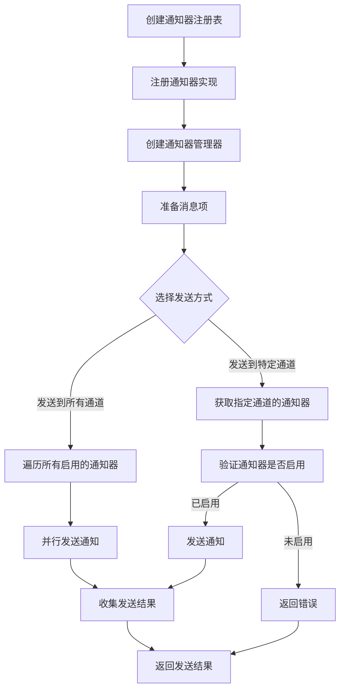
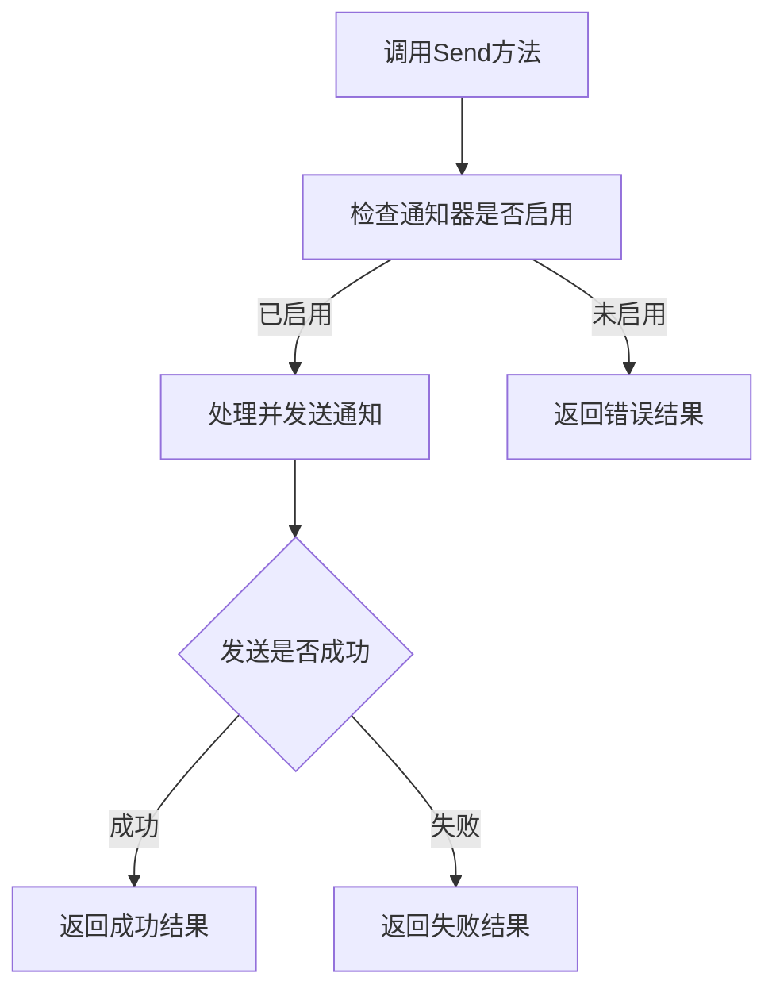
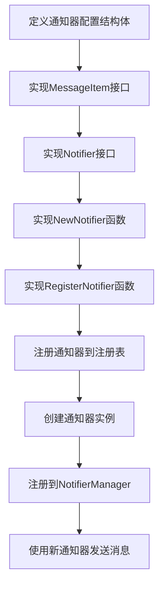

# 通知器系统架构设计与使用指南

## 1. 架构概述

通知器系统采用了插件化的架构设计，通过接口抽象和注册表模式实现了高度可扩展的通知功能。核心设计理念是将不同通知渠道的实现解耦，使其可以独立开发、测试和维护。

## 2. 核心组件与UML类图

### 2.1 UML类图

```mermaid
classDiagram
    class MessageItem {
        <<interface>>
        +Title() string
        +URL() string
        +Content() string
    }

    class Notifier {
        <<interface>>
        +Name() string
        +IsEnabled() bool
        +Send(ctx context.Context, items []MessageItem) *NotificationResult, error
    }

    class NotifierConfig {
        <<interface>>
        +IsEnabled() bool
    }

    class NotificationResult {
        -Channel string
        -Status NotificationStatus
        -TotalCount int
        -SuccessCount int
        -Error string
        -StartAt time.Time
        -EndAt time.Time
    }

    class NotifierManager {
        -notifiers []Notifier
        -wg sync.WaitGroup
        +NewNotifierManager() *NotifierManager, error
        +RegisterNotifier(name string, notifier Notifier)
        +SendToAll(items []MessageItem) map[string]*NotificationResult, error
        +SendToSpecific(channel string, items []MessageItem) *NotificationResult, error
        +GetEnabledChannels() []string
    }

    class NotifierRegistry {
        -factories map[string]NotifierFactory
        +NewNotifierRegistry() *NotifierRegistry
        +Register(name string, factory NotifierFactory)
        +Get(name string) NotifierFactory, bool
        +List() []string
    }

    class EmailNotifier {
        -config *EmailNotifierConfig
        -client *smtp.Client
        +NewNotifier(config *EmailNotifierConfig) *EmailNotifier, error
        +Name() string
        +IsEnabled() bool
        +Send(ctx context.Context, items []MessageItem) *NotificationResult, error
    }

    class SMSNotifier {
        -config *SMSNotifierConfig
        -client interface{}
        +NewNotifier(config *SMSNotifierConfig) *SMSNotifier, error
        +Name() string
        +IsEnabled() bool
        +Send(ctx context.Context, items []MessageItem) *NotificationResult, error
    }

    class DingtalkNotifier {
        -config *DingtalkNotifierConfig
        -client *http.Client
        +NewNotifier(config *DingtalkNotifierConfig) *DingtalkNotifier, error
        +Name() string
        +IsEnabled() bool
        +Send(ctx context.Context, items []MessageItem) *NotificationResult, error
    }

    class EmailNotifierConfig {
        -Enabled bool
        -SMTPHost string
        -SMTPPort int
        -Username string
        -Password string
        -From string
        -To []string
        -CC []string
        -BCC []string
        -UseTLS bool
        -UseSSL bool
        -MessageType string
        +IsEnabled() bool
    }

    class SMSNotifierConfig {
        -Enabled bool
        -Provider string
        -PhoneNumbers []string
        -AccessKey string
        -SecretKey string
        -Region string
        -TemplateID string
        -Signature string
        -CustomAPIURL string
        +IsEnabled() bool
    }

    class DingtalkNotifierConfig {
        -Enabled bool
        -WebhookURL string
        -Secret string
        -Proxy string
        -MessageType string
        +IsEnabled() bool
    }

    NotifierManager --> Notifier : manages
    NotifierRegistry --> Notifier : creates
    Notifier --> NotifierConfig : uses
    Notifier --> MessageItem : processes
    Notifier --> NotificationResult : returns

    Notifier <|.. EmailNotifier : implements
    Notifier <|.. SMSNotifier : implements
    Notifier <|.. DingtalkNotifier : implements

    NotifierConfig <|.. EmailNotifierConfig : implements
    NotifierConfig <|.. SMSNotifierConfig : implements
    NotifierConfig <|.. DingtalkNotifierConfig : implements
```

### 2.2 核心组件说明

- **MessageItem**: 消息项接口，定义了通知消息的数据结构
- **Notifier**: 通知器接口，定义了通知器的基本行为
- **NotifierConfig**: 通知器配置接口，定义了配置的基本行为
- **NotifierManager**: 通知管理器，负责管理多个通知器实例
- **NotifierRegistry**: 通知器注册表，负责注册和管理通知器工厂函数

### 2.3 工作流程





## 3. 包结构

```
utils/notifier/
├── types.go          # 核心接口定义
├── common.go         # 通用工具函数
├── notifier.go       # 通知器管理器实现
├── dingtalk/         # 钉钉通知器实现
├── email/            # 邮件通知器实现
└── sms/              # 短信通知器实现
```

## 4. 核心接口定义

### 4.1 MessageItem 接口

```go
type MessageItem interface {
    // Title 获取标题
    Title() string
    // URL 获取链接
    URL() string
    // Content 获取内容
    Content() string
}
```

### 4.2 Notifier 接口

```go
type Notifier interface {
    // Name 返回通知器名称
    Name() string
    // IsEnabled 检查是否启用
    IsEnabled() bool
    // Send 发送通知
    Send(ctx context.Context, items []MessageItem) (*NotificationResult, error)
}
```

### 4.3 NotifierConfig 接口

```go
type NotifierConfig interface {
    // IsEnabled 是否启用
    IsEnabled() bool
}
```

## 5. 通知器实现

### 5.1 邮件通知器 (EmailNotifier)

**功能**: 通过SMTP协议发送邮件通知

**配置结构**: 
```go
type EmailNotifierConfig struct {
    Enabled     bool     `json:"enabled"`
    SMTPHost    string   `json:"smtp_host"`
    SMTPPort    int      `json:"smtp_port"`
    Username    string   `json:"username"`
    Password    string   `json:"password"`
    From        string   `json:"from"`
    To          []string `json:"to"`
    CC          []string `json:"cc,omitempty"`
    BCC         []string `json:"bcc,omitempty"`
    UseTLS      bool     `json:"use_tls"`
    UseSSL      bool     `json:"use_ssl"`
    MessageType string   `json:"message_type"` // "text" 或 "html"
}
```

### 5.2 短信通知器 (SMSNotifier)

**功能**: 支持多种云服务商的短信发送

**配置结构**: 
```go
type SMSNotifierConfig struct {
    Enabled      bool     `json:"enabled"`
    Provider     string   `json:"provider"`      // "aliyun", "tencent", "aws", "custom"
    PhoneNumbers []string `json:"phone_numbers"` // 接收短信的手机号码
    AccessKey    string   `json:"access_key"`
    SecretKey    string   `json:"secret_key"`
    Region       string   `json:"region"`
    TemplateID   string   `json:"template_id"`
    Signature    string   `json:"signature"`
    CustomAPIURL string   `json:"custom_api_url"` // 自定义API地址
}
```

### 5.3 钉钉通知器 (DingtalkNotifier)

**功能**: 通过钉钉机器人发送通知消息

**配置结构**: 
```go
type DingtalkNotifierConfig struct {
    Enabled     bool   `json:"enabled"`
    WebhookURL  string `json:"webhook_url"`
    Secret      string `json:"secret,omitempty"`
    Proxy       string `json:"proxy,omitempty"`
    MessageType string `json:"message_type"` // "text" 或 "markdown"
}
```

## 6. 快速开始指南

### 6.1 初始化通知器系统

```go
import (
    "github.com/sjzsdu/utils/notifier"
    "github.com/sjzsdu/utils/notifier/dingtalk"
    "github.com/sjzsdu/utils/notifier/email"
    "github.com/sjzsdu/utils/notifier/sms"
)

// 创建通知器注册表
registry := notifier.NewNotifierRegistry()

// 注册所需的通知器实现
dingtalk.RegisterNotifier(registry)
email.RegisterNotifier(registry)
sms.RegisterNotifier(registry)

// 创建通知器管理器
manager, err := notifier.NewNotifierManager()
if err != nil {
    log.Fatalf("Failed to create notifier manager: %v", err)
}

// 准备并创建邮件通知器实例
emailConfig := &email.EmailNotifierConfig{
    Enabled:     true,
    SMTPHost:    "smtp.example.com",
    SMTPPort:    587,
    Username:    "your-email@example.com",
    Password:    "your-password",
    From:        "your-email@example.com",
    To:          []string{"recipient@example.com"},
    UseTLS:      true,
    MessageType: "html",
}

emailNotifier, err := email.NewNotifier(emailConfig)
if err != nil {
    log.Fatalf("Failed to create email notifier: %v", err)
}
manager.RegisterNotifier("email", emailNotifier)

// 准备并创建钉钉通知器实例
dingtalkConfig := &dingtalk.DingtalkNotifierConfig{
    Enabled:     true,
    WebhookURL:  "https://oapi.dingtalk.com/robot/send?access_token=xxx",
    Secret:      "xxx",
    MessageType: "markdown",
}

 dingtalkNotifier, err := dingtalk.NewNotifier(dingtalkConfig)
if err != nil {
    log.Fatalf("Failed to create dingtalk notifier: %v", err)
}
manager.RegisterNotifier("dingtalk", dingtalkNotifier)
```

### 6.2 创建和发送消息

```go
import (
    "time"
    "github.com/sjzsdu/utils/notifier"
)

// 定义自定义消息项
 type MyMessageItem struct {
    title    string
    url      string
    isHot    bool
    isNew    bool
    source   string
    category string
}

func (m *MyMessageItem) Title() string       { return m.title }
func (m *MyMessageItem) URL() string         { return m.url }
func (m *MyMessageItem) IsHot() bool         { return m.isHot }
func (m *MyMessageItem) IsNew() bool         { return m.isNew }
func (m *MyMessageItem) GetSource() string   { return m.source }
func (m *MyMessageItem) GetCategory() string { return m.category }

// 创建消息项
messageItems := []notifier.MessageItem{
    &MyMessageItem{
        title:    "重要通知",
        url:      "https://example.com/events/123",
        isHot:    true,
        isNew:    true,
        source:   "example.com",
        category: "技术",
    },
    &MyMessageItem{
        title:    "系统更新",
        url:      "https://example.com/updates",
        isHot:    false,
        isNew:    true,
        source:   "example.com",
        category: "系统",
    },
}

// 发送到所有启用的通知器
results, err := manager.SendToAll(messageItems)
if err != nil {
    log.Printf("Failed to send notification: %v", err)
}

// 检查发送结果
for notifierType, result := range results {
    if result.Status == notifier.StatusSuccess {
        log.Printf("Notification sent successfully via %s", notifierType)
    } else {
        log.Printf("Failed to send notification via %s: %s", notifierType, result.Error)
    }
}

// 发送到特定的通知器
result, err := manager.SendToSpecific("dingtalk", messageItems)
if err != nil {
    log.Printf("Failed to send notification to dingtalk: %v", err)
}
```

## 7. 配置说明

### 7.1 邮件通知器配置

**必填字段**:
- `Enabled`: 是否启用通知器
- `SMTPHost`: SMTP服务器地址
- `SMTPPort`: SMTP服务器端口
- `Username`: SMTP用户名
- `Password`: SMTP密码
- `From`: 发件人邮箱
- `To`: 收件人邮箱列表

**可选字段**:
- `CC`: 抄送邮箱列表
- `BCC`: 密送邮箱列表
- `UseTLS`: 是否使用TLS加密
- `UseSSL`: 是否使用SSL加密
- `MessageType`: 消息类型 ("text" 或 "html")

### 7.2 短信通知器配置

**必填字段**:
- `Enabled`: 是否启用通知器
- `Provider`: 短信服务提供商
- `PhoneNumbers`: 接收短信的手机号码列表
- `AccessKey`: 云服务商访问密钥
- `SecretKey`: 云服务商密钥

**可选字段**:
- `Region`: 云服务区域
- `TemplateID`: 短信模板ID
- `Signature`: 短信签名
- `CustomAPIURL`: 自定义API地址（当Provider为"custom"时必填）

### 7.3 钉钉通知器配置

**必填字段**:
- `Enabled`: 是否启用通知器
- `WebhookURL`: 钉钉机器人Webhook地址

**可选字段**:
- `Secret`: 钉钉机器人密钥（用于签名验证）
- `Proxy`: 代理服务器地址
- `MessageType`: 消息类型 ("text" 或 "markdown")

## 8. 实现自定义消息项

要使用通知器系统，你需要实现 `MessageItem` 接口：

```go
import (
    "time"
)

type MyMessageItem struct {
    title   string
    url     string
    content string
    // 其他自定义字段
}

// 实现 MessageItem 接口
func (m *MyMessageItem) Title() string {
    return m.title
}

func (m *MyMessageItem) URL() string {
    return m.url
}

func (m *MyMessageItem) Content() string {
    return m.content
}
```

## 9. 添加新的通知器

### 9.1 实现通知器接口

在新的子包中实现 `Notifier` 接口：

```go
import (
    "context"
    "errors"
    "time"
    
    "github.com/sjzsdu/utils/notifier"
)

// 定义配置结构
type MyNotifierConfig struct {
    Enabled bool   `json:"enabled"`
    URL     string `json:"url"`
    // 其他配置项
}

// 实现 IsEnabled 方法
func (c *MyNotifierConfig) IsEnabled() bool {
    return c.Enabled && c.URL != ""
}

// 通知器实现
type MyNotifier struct {
    config *MyNotifierConfig
}

// 实现 Name 方法
func (n *MyNotifier) Name() string {
    return "mynotifier"
}

// 实现 IsEnabled 方法
func (n *MyNotifier) IsEnabled() bool {
    return n.config.IsEnabled()
}

// 实现 Send 方法
func (n *MyNotifier) Send(ctx context.Context, items []notifier.MessageItem) (*notifier.NotificationResult, error) {
    result := &notifier.NotificationResult{
        Channel:    n.Name(),
        Status:     notifier.StatusPending,
        TotalCount: len(items),
        StartAt:    time.Now(),
    }
    
    // 实现发送逻辑
    
    result.Status = notifier.StatusSuccess
    result.SuccessCount = len(items)
    result.EndAt = time.Now()
    return result, nil
}

// 构造函数
func NewNotifier(cfg *MyNotifierConfig) (*MyNotifier, error) {
    if cfg == nil {
        return nil, errors.New("配置为空")
    }
    
    return &MyNotifier{config: cfg}, nil
}

// 注册函数
func RegisterNotifier(registry *notifier.NotifierRegistry) {
    registry.Register("mynotifier", func(config notifier.NotifierConfig) (notifier.Notifier, error) {
        myConfig, ok := config.(*MyNotifierConfig)
        if !ok {
            return nil, errors.New("配置类型错误")
        }
        return NewNotifier(myConfig)
    })
}
```

### 9.2 注册通知器

```go
// 在应用程序初始化时
registry := notifier.NewNotifierRegistry()

// 注册自定义通知器
mynotifier.RegisterNotifier(registry)

// 或者直接注册通知器实例
manager.RegisterNotifier("mynotifier", myNotifierInstance)
```

## 10. 最佳实践

### 10.1 错误处理

通知器发送失败时，系统会返回详细的错误信息，建议实现适当的错误处理：

```go
results, err := manager.SendToAll(messageItems)
for notifierType, result := range results {
    if result.Status != notifier.StatusSuccess {
        // 记录错误
        log.Printf("Notification failed via %s: %s", notifierType, result.Error)
        
        // 考虑实现重试逻辑
        if shouldRetry(result.Error) {
            go func(nt string, items []notifier.MessageItem) {
                // 延迟重试
                time.Sleep(5 * time.Second)
                manager.SendToSpecific(nt, items)
            }(notifierType, messageItems)
        }
    }
}
```


### 10.3 并发控制

通知器管理器会自动并发发送通知到所有启用的通知渠道，无需额外的并发控制。系统会处理并发安全和结果收集。

## 11. 扩展机制

### 11.1 添加新通知器的流程



### 11.2 通知器注册模式

通知器可以通过多种方式注册：

1. 通过 `NotifierRegistry.Register()` 注册通知器工厂函数
2. 直接通过 `NotifierManager.RegisterNotifier()` 注册通知器实例

```go
// 注册通知器工厂函数的示例
registry.Register("mynotifier", func(config notifier.NotifierConfig) (notifier.Notifier, error) {
    return mynotifier.NewNotifier(config)
})

// 直接注册通知器实例的示例
manager.RegisterNotifier("mynotifier", myNotifierInstance)
```


## 12. 核心工具函数

### 12.1 核心工具函数

- `FormatNotificationTitle`: 格式化通知标题
- `FormatNotificationSummary`: 格式化通知摘要

## 13. 通知结果处理

通知发送后会返回详细的结果信息：

```go
type NotificationResult struct {
    Channel      string             // 通知渠道
    Status       NotificationStatus // 通知状态
    TotalCount   int                // 总消息数
    SuccessCount int                // 成功消息数
    Error        string             // 错误信息
    StartAt      time.Time          // 开始时间
    EndAt        time.Time          // 结束时间
}
```

通知状态包括：
- `StatusPending`: 待处理
- `StatusSuccess`: 成功
- `StatusFailed`: 失败
